# data-scope

A Clojure library inspired by [Spyscope](https://github.com/dgrnbrg/spyscope) to provide tools for interactively visualizing data.

## Installation


#### Leiningen

Add `[jsofra/data-scope "0.1.0"]` to your project.clj's `:dependencies`.

If you want data-scope to be automatically loaded and available in every project,
add the following to the `:user` profile in `~/.lein/profiles.clj`:

    :dependencies [[jsofra/data-scope "0.1.0"]]
    :injections [(require 'data-scope.charts)
                 (require 'data-scope.graphs)
                 (require 'data-scope.inspect)
                 (require 'data-scope.pprint)]

#### Boot

After requiring the namespace, you must also run `(boot.core/load-data-readers!)`
to get the reader tags working. Using a `~/.boot/profile.boot` file:

```
(set-env! :dependencies #(conj % '[jsofra/data-scope "0.1.0"]))
(boot.core/load-data-readers!)
(require 'data-scope.charts)
(require 'data-scope.graphs)
(require 'data-scope.inspect)
(require 'data-scope.pprint)
```

## Usage

Data-scope includes a number of reader tools for visualizing Clojure data.

Currently there are readers tags for visualizing data as both charts, graphs, tables and trees.
There is also support for pretty printing data. See all the usage examples below for the details.

### Inspectors

The inspector tags are:

* `#ds/i` - *inspect the Clojure data structure in a tree inspector*
* `#ds/it` *inspect the data in a table inspector*

#### `#ds/i`

``` clojure
user> (let [data [{:a 4 :b [4 5] :c [{:b 4 :n {:v {:d {:f [4 4]}}}}]}]]
        #ds/i data)
[{:a 4 :b [4 5] :c [{:b 4 :n {:v {:d {:f [4 4]}}}}]}]
```


#### `#ds/it`

``` clojure
user> (let [data [{:first-name "James" :last-name "Sofra" :age 36} {:first-name "Ada" :last-name "Lovelace":age 201 }]]
        #ds/it data)
[{:first-name "James" :last-name "Sofra" :age 36} {:first-name "Ada" :last-name "Lovelace":age 201 }]
```


``` clojure
user> (let [data [(range 9 19) (range 4 14) (range 2 12) (range 20 30)]]
        #ds/it data)
[(9 10 11 12 13 14 15 16 17 18) (4 5 6 7 8 9 10 11 12 13) (2 3 4 5 6 7 8 9 10 11) (20 21 22 23 24 25 26 27 28 29)]
```


### Pretty Print

The pretty print tags are:

* `#ds/pp` - *Pretty print a form*
* `#ds/pt` - *Print data as a table*

#### `#ds/pp`

``` clojure
user> (let [data [{:a 4 :b (range 20) :c [{:b 4 :n {:v {:d {:f [4 4]}}}}]}]]
        #ds/pp data)

[{:a 4,
  :b (0 1 2 3 4 5 6 7 8 9 10 11 12 13 14 15 16 17 18 19),
  :c [{:b 4, :n {:v {:d {:f [4 4]}}}}]}]

[{:a 4, :b (0 1 2 3 4 5 6 7 8 9 10 11 12 13 14 15 16 17 18 19), :c [{:b 4, :n {:v {:d {:f [4 4]}}}}]}]
```

#### `#ds/pt`

``` clojure
user> (let [data [{:first-name "James" :last-name "Sofra" :age 36} {:first-name "Ada" :last-name "Lovelace":age 201 }]]
        #ds/pt data)

| :first-name | :last-name | :age |
|-------------+------------+------|
|       James |      Sofra |   36 |
|         Ada |   Lovelace |  201 |

[{:first-name "James" :last-name "Sofra" :age 36} {:first-name "Ada" :last-name "Lovelace":age 201 }]
```

``` clojure
user> (let [data [(range 9 19) (range 4 14) (range 2 12) (range 20 30)]]
        #ds/pt data)

|  0 |  1 |  2 |  3 |  4 |  5 |  6 |  7 |  8 |  9 |
|----+----+----+----+----+----+----+----+----+----|
|  9 | 10 | 11 | 12 | 13 | 14 | 15 | 16 | 17 | 18 |
|  4 |  5 |  6 |  7 |  8 |  9 | 10 | 11 | 12 | 13 |
|  2 |  3 |  4 |  5 |  6 |  7 |  8 |  9 | 10 | 11 |
| 20 | 21 | 22 | 23 | 24 | 25 | 26 | 27 | 28 | 29 |

[(9 10 11 12 13 14 15 16 17 18) (4 5 6 7 8 9 10 11 12 13) (2 3 4 5 6 7 8 9 10 11) (20 21 22 23 24 25 26 27 28 29)]
```

### Graphs

The graph tags are:

* `#ds/graph` - *graph viz*
* `#ds/tree` - *tree viz*
* `#ds/trie` - *trie viz*
* `#ds/dot` - *dot graph viz*

#### Graph Examples

#### `#ds/graph`

``` clojure
user> (let [data {:a [:b :c]
                  :b [:c]
                  :c [:a]}]
        #ds/graph data)
{:a [:b :c], :b [:c], :c [:a]}
```


#### `#ds/tree`

``` clojure
user> (let [data [[1 [2 3]] [4 [5]]]]
        #ds/tree data)
[[1 [2 3]] [4 [5]]]
```


#### `#ds/trie`

``` clojure
user> (let [data '([1 2] ([3 4] ([5 6 7])))]
        #ds/trie data)
([1 2] ([3 4] ([5 6 7])))
```


### Charts

Each of the chart tags may visualize:

* Numeric sequences
  * (range 10)
* Sequences of numeric sequences
  * [(range 10) (reverse (range 10))]
* Maps with numeric sequences as values
  * {:a (range 10) :b (reverse (range 10))}
  * except `#ds/p` which can visualize a map with numeric values as values
    * {:a 1 :b 2}

The tags are:

* `#ds/b` - *bar chart*
* `#ds/b-sum` - *row wise summed bar chart*
* `#ds/b-max` - *row wise maximum bar chart*
* `#ds/b-min` - *row wise minimum bar chart*
* `#ds/b-sum*` - *column wise summed bar chart*
* `#ds/b-max*` - *column wise maximum bar chart*
* `#ds/b-min*` - *column wise minimum bar chart*
* `#ds/l` - *line chart*
* `#ds/l-sum` - *row wise summed line chart*
* `#ds/l-max` - *row wise maximum line chart*
* `#ds/l-min` - *row wise minimum line chart*
* `#ds/l-sum*` - *column wise summed line chart*
* `#ds/l-max*` - *column wise maximum line chart*
* `#ds/l-min*` - *column wise minimum line chart*
* `#ds/a` - *area chart*
* `#ds/a-sum` - *row wise summed area chart*
* `#ds/a-max` - *row wise maximum area chart*
* `#ds/a-min` - *row wise minimum area chart*
* `#ds/a-sum*` - *column wise summed area chart*
* `#ds/a-max*` - *column wise maximum area chart*
* `#ds/a-min*` - *column wise minimum area chart*
* `#ds/sa` - *stacked area chart*
* `#ds/sa-sum` - *row wise summed stacked area chart*
* `#ds/sa-max` - *row wise maximum stacked area chart*
* `#ds/sa-min` - *row wise minimum stacked area chart*
* `#ds/sa-sum*` - *column wise summed stacked area chart*
* `#ds/sa-max*` - *column wise maximum stacked area chart*
* `#ds/sa-min*` - *column wise minimum stacked area chart*
* `#ds/p` - *pie chart*
* `#ds/p-sum` - *row wise summed pie chart*
* `#ds/p-max` - *row wise maximum pie chart*
* `#ds/p-min` - *row wise minimum pie chart*
* `#ds/p-sum*` - *column wise summed pie chart*
* `#ds/p-max*` - *column wise maximum pie chart*
* `#ds/p-min*` - *column wise minimum pie chart*
* `#ds/hf` - *histogram frequency chart*
* `#ds/hd` - *histogram density chart*

#### Chart Examples

#### `#ds/b`

``` clojure
user> #ds/b (range 10)
```
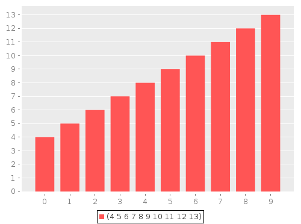

``` clojure
user> #ds/b [(range 10) [20 1 2 23 8 3 7 4 6 5] (reverse (range 4 14))]
```
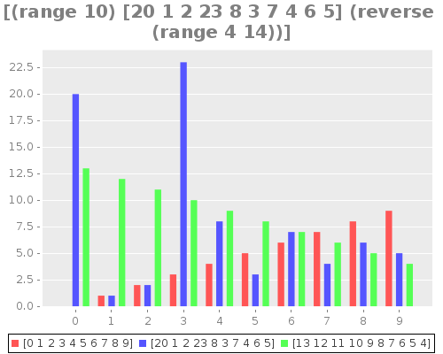

``` clojure
user> #ds/b {:a (range 10), :b [20 1 2 23 8 3 7 4 6 5], :c (reverse (range 4 14))}
```
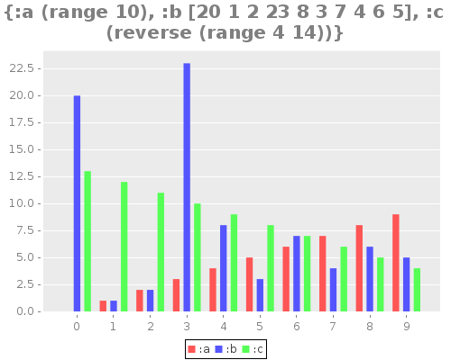


#### `#ds/b-sum` - row wise sum

``` clojure
user> #ds/b-sum [(range 10) [20 1 2 23 8 3 7 4 6 5] (reverse (range 4 14))]
```
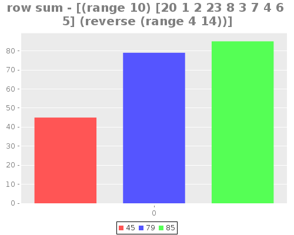

``` clojure
user> #ds/b-sum {:a (range 10), :b [20 1 2 23 8 3 7 4 6 5], :c (reverse (range 4 14))}
```
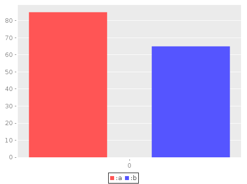


#### `#ds/b-sum*` - column wise sum

``` clojure
user> #ds/b-sum* [(range 10) [20 1 2 23 8 3 7 4 6 5] (reverse (range 4 14))]
```
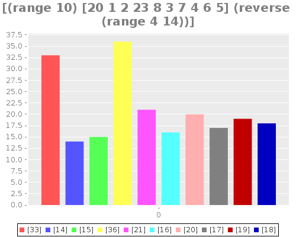

``` clojure
user> #ds/b-sum* {:a (range 10), :b [20 1 2 23 8 3 7 4 6 5], :c (reverse (range 4 14))}
```


#### `#ds/b-max` - row wise max

``` clojure
user> #ds/b-max [(range 10) [20 1 2 23 8 3 7 4 6 5] (reverse (range 4 14))]
```
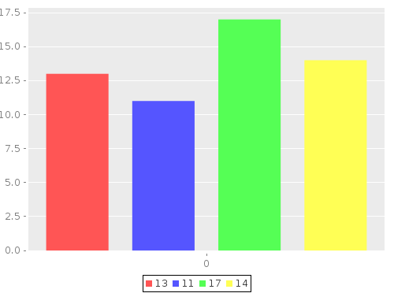

``` clojure
user> #ds/b-max {:a (range 10), :b [20 1 2 23 8 3 7 4 6 5], :c (reverse (range 4 14))}
```
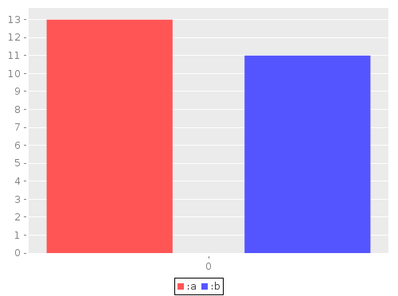


#### `#ds/b-max*` - column wise max

``` clojure
user> #ds/b-max* [(range 10) [20 1 2 23 8 3 7 4 6 5] (reverse (range 4 14))]
```
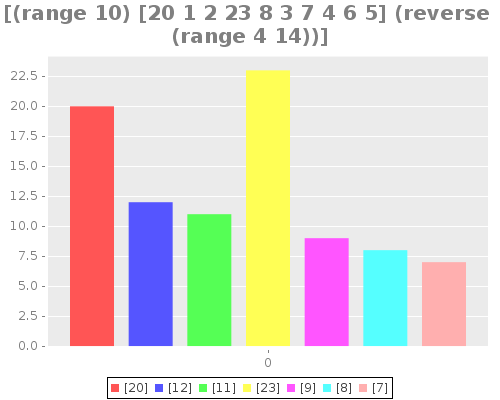

``` clojure
user> #ds/b-max* {:a (range 10), :b [20 1 2 23 8 3 7 4 6 5], :c (reverse (range 4 14))}
```
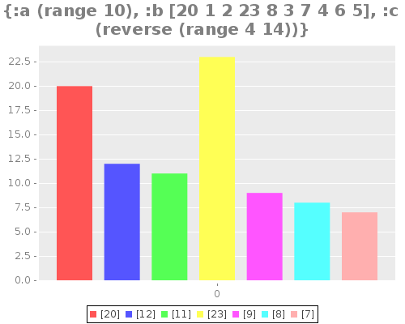


#### `#ds/b-min` - row wise min

``` clojure
user> #ds/b-min [(range 10) [20 1 2 23 8 3 7 4 6 5] (reverse (range 4 14))]
```


``` clojure
user> #ds/b-min {:a (range 10), :b [20 1 2 23 8 3 7 4 6 5], :c (reverse (range 4 14))}
```
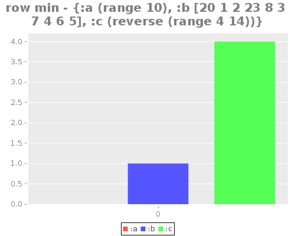


#### `#ds/b-min*` - column wise min

``` clojure
user> #ds/b-min* [(range 10) [20 1 2 23 8 3 7 4 6 5] (reverse (range 4 14))]
```


``` clojure
user> #ds/b-min* {:a (range 10), :b [20 1 2 23 8 3 7 4 6 5], :c (reverse (range 4 14))}
```
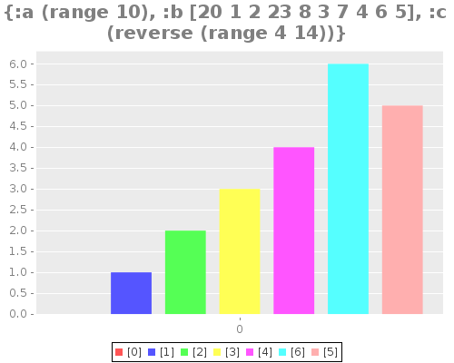


#### `#ds/l`

``` clojure
user> #ds/l (range 10)
```
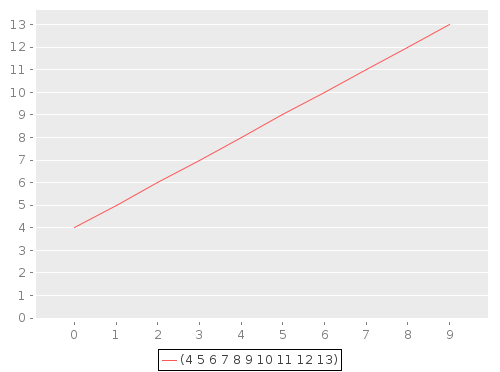

``` clojure
user> #ds/l [(range 10) [20 1 2 23 8 3 7 4 6 5] (reverse (range 4 14))]
```
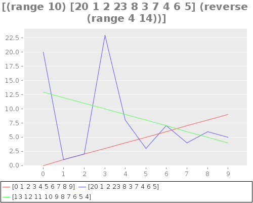

``` clojure
user> #ds/l {:a (range 10), :b [20 1 2 23 8 3 7 4 6 5], :c (reverse (range 4 14))}
```


#### `#ds/l-sum` - row wise sum

``` clojure
user> #ds/l-sum [(range 10) [20 1 2 23 8 3 7 4 6 5] (reverse (range 4 14))]
```
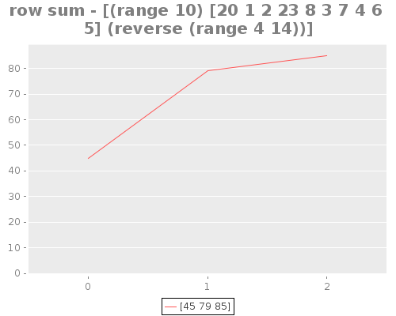

``` clojure
user> #ds/l-sum {:a (range 10), :b [20 1 2 23 8 3 7 4 6 5], :c (reverse (range 4 14))}
```
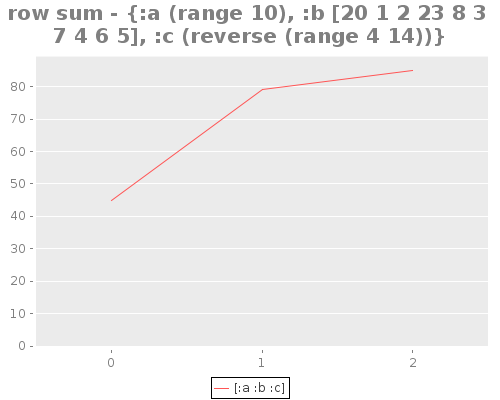


#### `#ds/l-sum*` - column wise sum

``` clojure
user> #ds/l-sum* [(range 10) [20 1 2 23 8 3 7 4 6 5] (reverse (range 4 14))]
```
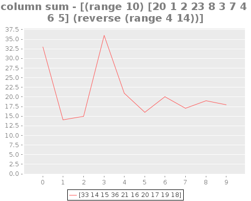

``` clojure
user> #ds/l-sum* {:a (range 10), :b [20 1 2 23 8 3 7 4 6 5], :c (reverse (range 4 14))}
```
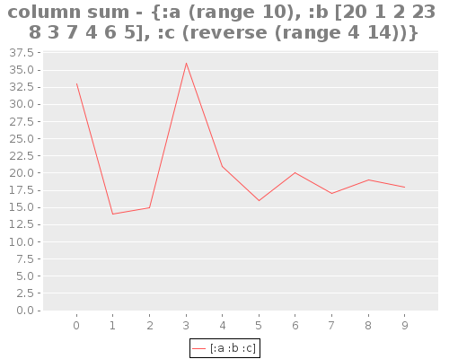


#### `#ds/l-max` - row wise max

``` clojure
user> #ds/l-max [(range 10) [20 1 2 23 8 3 7 4 6 5] (reverse (range 4 14))]
```
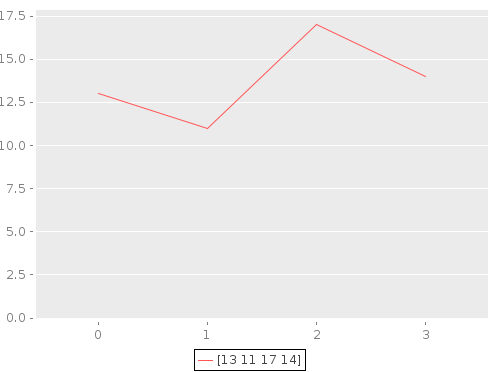

``` clojure
user> #ds/l-max {:a (range 10), :b [20 1 2 23 8 3 7 4 6 5], :c (reverse (range 4 14))}
```
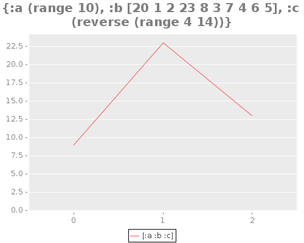


#### `#ds/l-max*` - column wise max

``` clojure
user> #ds/l-max* [(range 10) [20 1 2 23 8 3 7 4 6 5] (reverse (range 4 14))]
```
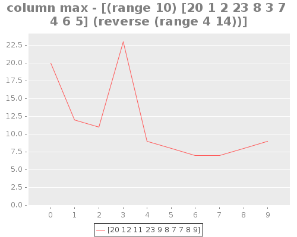

``` clojure
user> #ds/l-max* {:a (range 10), :b [20 1 2 23 8 3 7 4 6 5], :c (reverse (range 4 14))}
```
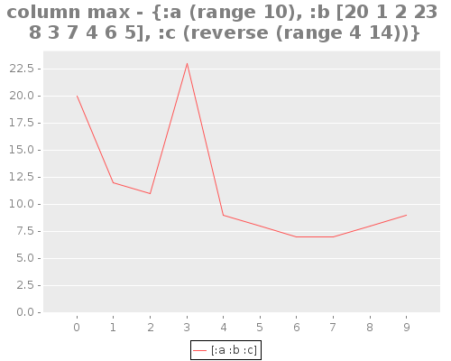


#### `#ds/l-min` - row wise min

``` clojure
user> #ds/l-min [(range 10) [20 1 2 23 8 3 7 4 6 5] (reverse (range 4 14))]
```
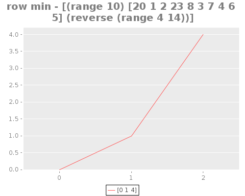

``` clojure
user> #ds/l-min {:a (range 10), :b [20 1 2 23 8 3 7 4 6 5], :c (reverse (range 4 14))}
```
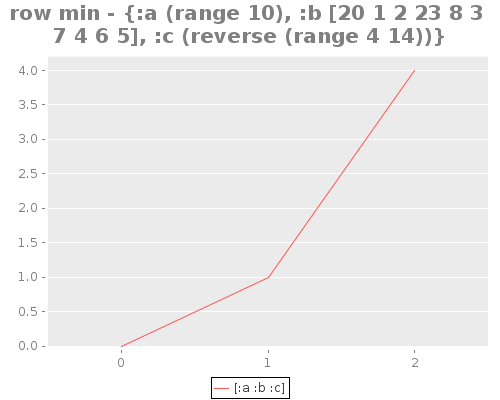


#### `#ds/l-min*` - column wise min

``` clojure
user> #ds/l-min* [(range 10) [20 1 2 23 8 3 7 4 6 5] (reverse (range 4 14))]
```
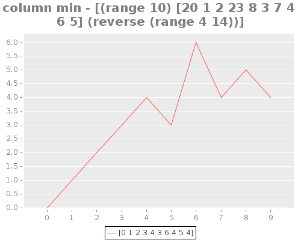

``` clojure
user> #ds/l-min* {:a (range 10), :b [20 1 2 23 8 3 7 4 6 5], :c (reverse (range 4 14))}
```
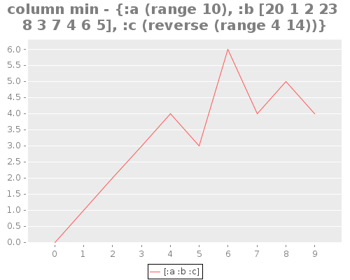


#### `#ds/a`

``` clojure
user> #ds/a (range 10)
```
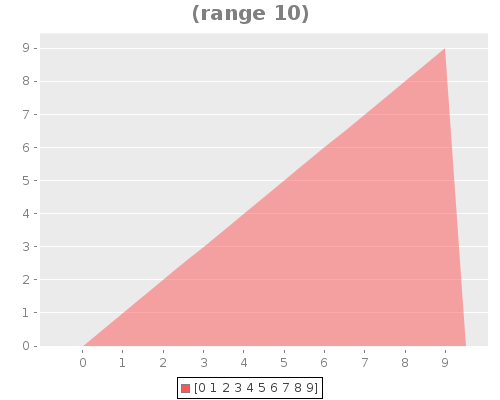

``` clojure
user> #ds/a [(range 10) [20 1 2 23 8 3 7 4 6 5] (reverse (range 4 14))]
```


``` clojure
user> #ds/a {:a (range 10), :b [20 1 2 23 8 3 7 4 6 5], :c (reverse (range 4 14))}
```
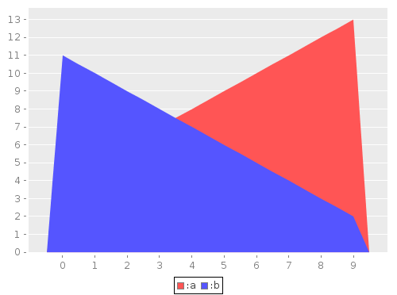


#### `#ds/a-sum` - row wise sum

``` clojure
user> #ds/a-sum [(range 10) [20 1 2 23 8 3 7 4 6 5] (reverse (range 4 14))]
```


``` clojure
user> #ds/a-sum {:a (range 10), :b [20 1 2 23 8 3 7 4 6 5], :c (reverse (range 4 14))}
```
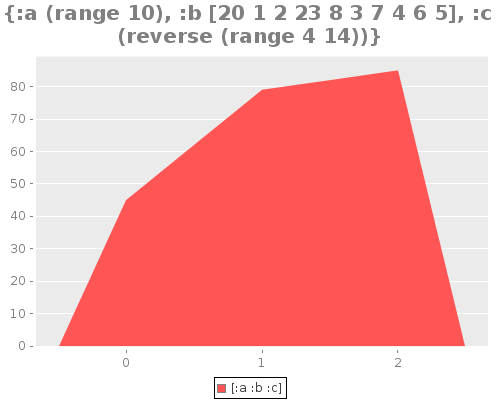


#### `#ds/a-sum*` - column wise sum

``` clojure
user> #ds/a-sum* [(range 10) [20 1 2 23 8 3 7 4 6 5] (reverse (range 4 14))]
```
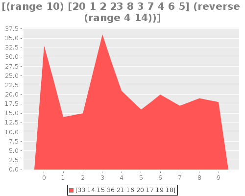

``` clojure
user> #ds/a-sum* {:a (range 10), :b [20 1 2 23 8 3 7 4 6 5], :c (reverse (range 4 14))}
```
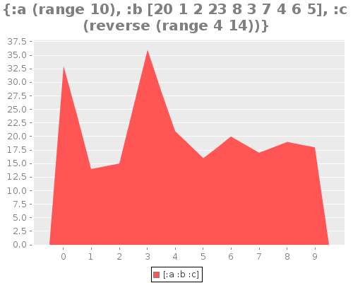


#### `#ds/a-max` - row wise max

``` clojure
user> #ds/a-max [(range 10) [20 1 2 23 8 3 7 4 6 5] (reverse (range 4 14))]
```
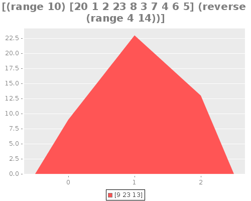

``` clojure
user> #ds/a-max {:a (range 10), :b [20 1 2 23 8 3 7 4 6 5], :c (reverse (range 4 14))}
```
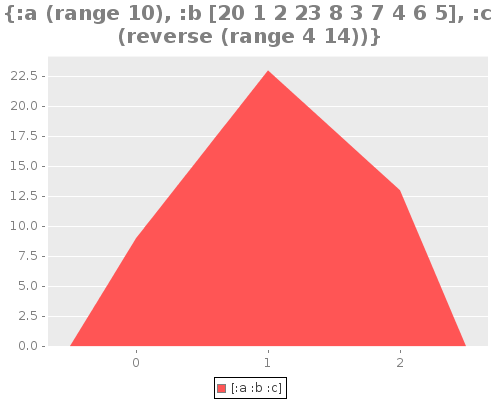


#### `#ds/a-max*` - column wise max

``` clojure
user> #ds/a-max* [(range 10) [20 1 2 23 8 3 7 4 6 5] (reverse (range 4 14))]
```
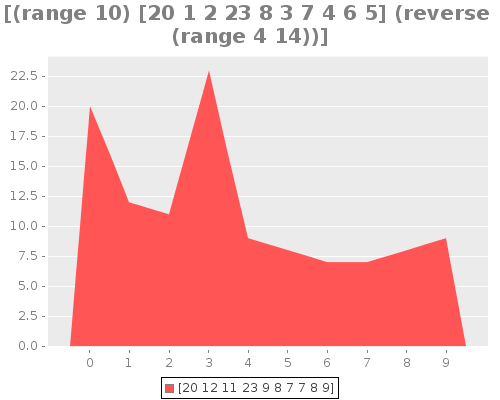

``` clojure
user> #ds/a-max* {:a (range 10), :b [20 1 2 23 8 3 7 4 6 5], :c (reverse (range 4 14))}
```
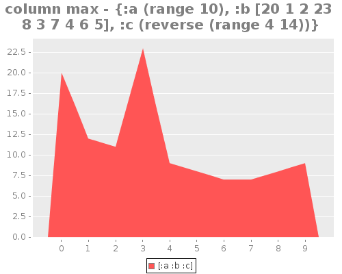


#### `#ds/a-min` - row wise min

``` clojure
user> #ds/a-min [(range 10) [20 1 2 23 8 3 7 4 6 5] (reverse (range 4 14))]
```
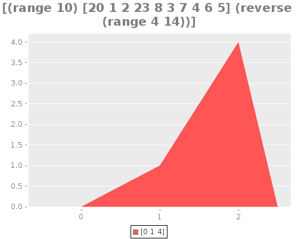

``` clojure
user> #ds/a-min {:a (range 10), :b [20 1 2 23 8 3 7 4 6 5], :c (reverse (range 4 14))}
```
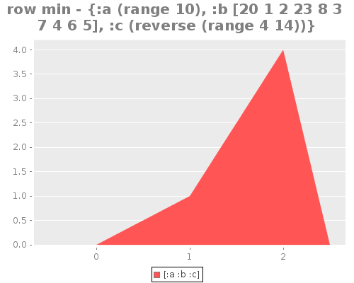


#### `#ds/a-min*` - column wise min

``` clojure
user> #ds/a-min* [(range 10) [20 1 2 23 8 3 7 4 6 5] (reverse (range 4 14))]
```
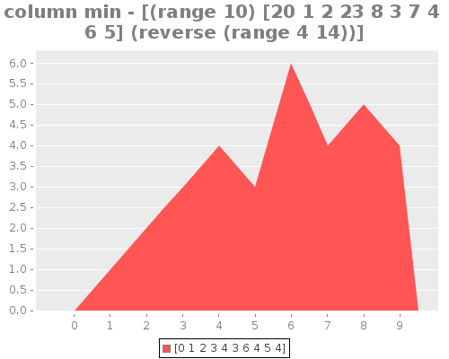

``` clojure
user> #ds/a-min* {:a (range 10), :b [20 1 2 23 8 3 7 4 6 5], :c (reverse (range 4 14))}
```


#### `#ds/sa`

``` clojure
user> #ds/sa (range 10)
```
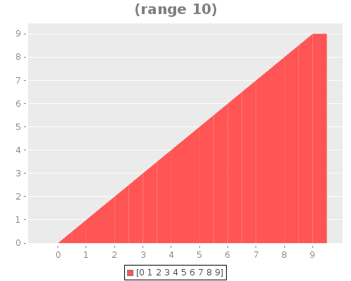

``` clojure
user> #ds/sa [(range 10) [20 1 2 23 8 3 7 4 6 5] (reverse (range 4 14))]
```
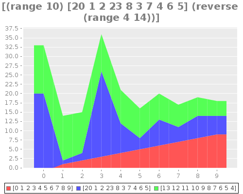

``` clojure
user> #ds/sa {:a (range 10), :b [20 1 2 23 8 3 7 4 6 5], :c (reverse (range 4 14))}
```
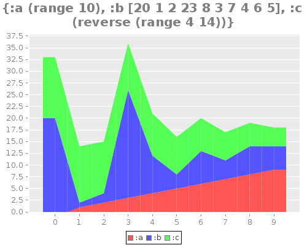


#### `#ds/sa-sum` - row wise sum

``` clojure
user> #ds/sa-sum [(range 10) [20 1 2 23 8 3 7 4 6 5] (reverse (range 4 14))]
```
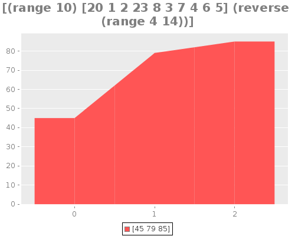

``` clojure
user> #ds/sa-sum {:a (range 10), :b [20 1 2 23 8 3 7 4 6 5], :c (reverse (range 4 14))}
```
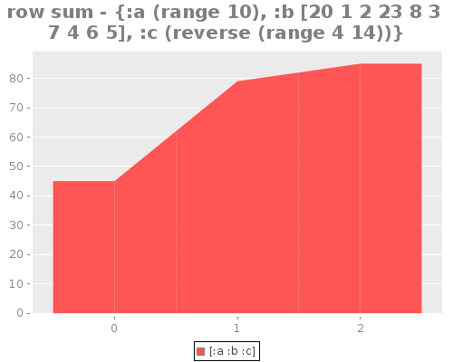


#### `#ds/sa-sum*` - column wise sum

``` clojure
user> #ds/sa-sum* [(range 10) [20 1 2 23 8 3 7 4 6 5] (reverse (range 4 14))]
```
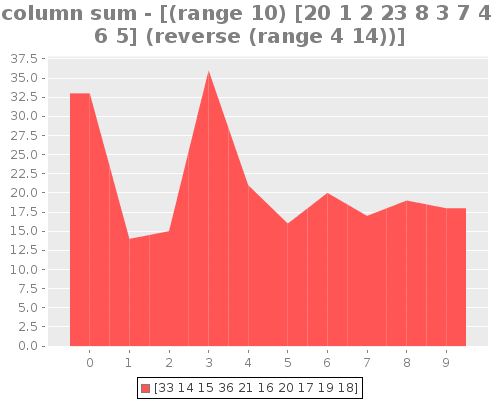

``` clojure
user> #ds/sa-sum* {:a (range 10), :b [20 1 2 23 8 3 7 4 6 5], :c (reverse (range 4 14))}
```
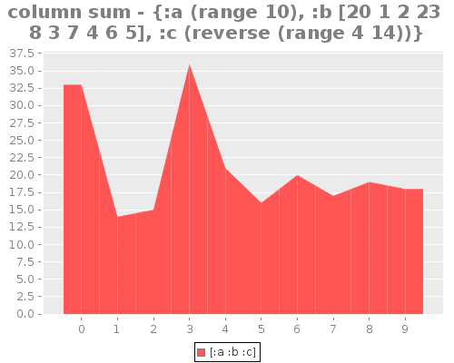


#### `#ds/sa-max` - row wise max

``` clojure
user> #ds/sa-max [(range 10) [20 1 2 23 8 3 7 4 6 5] (reverse (range 4 14))]
```
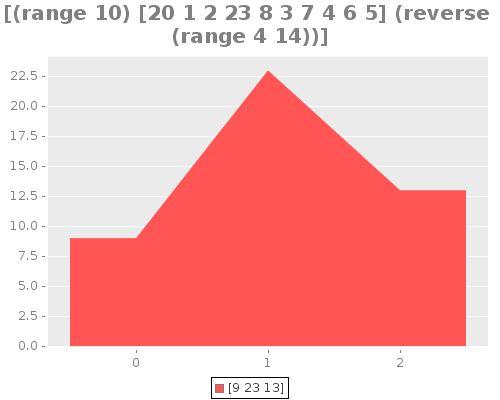

``` clojure
user> #ds/sa-max {:a (range 10), :b [20 1 2 23 8 3 7 4 6 5], :c (reverse (range 4 14))}
```
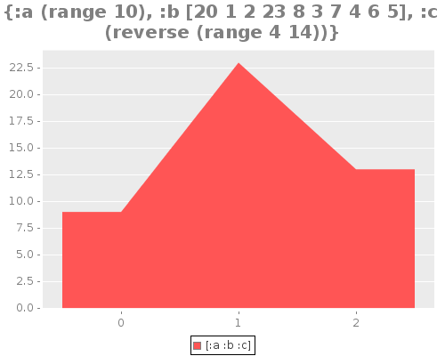


#### `#ds/sa-max*` - column wise max

``` clojure
user> #ds/sa-max* [(range 10) [20 1 2 23 8 3 7 4 6 5] (reverse (range 4 14))]
```
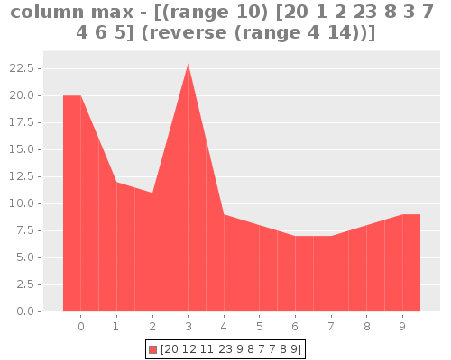

``` clojure
user> #ds/sa-max* {:a (range 10), :b [20 1 2 23 8 3 7 4 6 5], :c (reverse (range 4 14))}
```
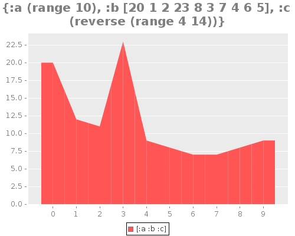


#### `#ds/sa-min` - row wise min

``` clojure
user> #ds/sa-min [(range 10) [20 1 2 23 8 3 7 4 6 5] (reverse (range 4 14))]
```
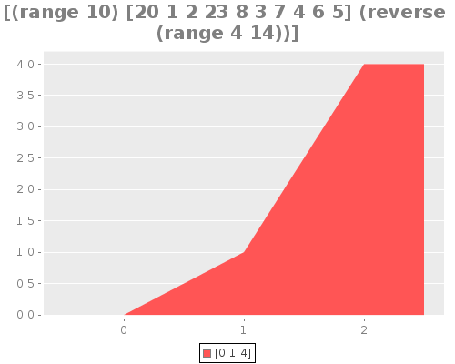

``` clojure
user> #ds/sa-min {:a (range 10), :b [20 1 2 23 8 3 7 4 6 5], :c (reverse (range 4 14))}
```


#### `#ds/sa-min*` - column wise min

``` clojure
user> #ds/sa-min* [(range 10) [20 1 2 23 8 3 7 4 6 5] (reverse (range 4 14))]
```


``` clojure
user> #ds/sa-min* {:a (range 10), :b [20 1 2 23 8 3 7 4 6 5], :c (reverse (range 4 14))}
```


#### `#ds/p`

``` clojure
user> #ds/p (range 10)
```


``` clojure
user> #ds/p [(range 2) [8 1 2] [2 4]]
```


``` clojure
user> #ds/p {:a 10, :b 2, :c 6}
```


#### `#ds/p-sum` - row wise sum

``` clojure
user> #ds/p-sum [(range 10) [20 1 2 23 8 3 7 4 6 5] (reverse (range 4 14))]
```


``` clojure
user> #ds/p-sum {:a (range 10), :b [20 1 2 23 8 3 7 4 6 5], :c (reverse (range 4 14))}
```


#### `#ds/p-sum*` - column wise sum
``` clojure
user> #ds/p-sum* [(range 10) [20 1 2 23 8 3 7 4 6 5] (reverse (range 4 14))]
```


``` clojure
user> #ds/p-sum* {:a (range 10), :b [20 1 2 23 8 3 7 4 6 5], :c (reverse (range 4 14))}
```


#### `#ds/p-max` - row wise max

``` clojure
user> #ds/p-max [(range 10) [20 1 2 23 8 3 7 4 6 5] (reverse (range 4 14))]
```


``` clojure
user> #ds/p-max {:a (range 10), :b [20 1 2 23 8 3 7 4 6 5], :c (reverse (range 4 14))}
```


#### `#ds/p-max*` - column wise max

``` clojure
user> #ds/p-max* [(range 10) [20 1 2 23 8 3 7 4 6 5] (reverse (range 4 14))]
```


``` clojure
user> #ds/p-max* {:a (range 10), :b [20 1 2 23 8 3 7 4 6 5], :c (reverse (range 4 14))}
```


#### `#ds/p-min` - row wise min

``` clojure
user> #ds/p-min [(range 10) [20 1 2 23 8 3 7 4 6 5] (reverse (range 4 14))]
```


``` clojure
user> #ds/p-min {:a (range 10), :b [20 1 2 23 8 3 7 4 6 5], :c (reverse (range 4 14))}
```


#### `#ds/p-min*` - column wise min

``` clojure
user> #ds/p-min* [(range 10) [20 1 2 23 8 3 7 4 6 5] (reverse (range 4 14))]
```


``` clojure
user> #ds/p-min* {:a (range 10), :b [20 1 2 23 8 3 7 4 6 5], :c (reverse (range 4 14))}
```


#### `#ds/hf`

``` clojure
user> #ds/hf [8 8 8 8 2 2 2 3 4 7 7 7 1 1 1]
```


``` clojure
user> #ds/hf [(range 10) [8 8 8 8 2 2 2 3 4 7 7 7 1 1 1]]
```


``` clojure
user> #ds/hf {:a (range 10), :b [8 8 8 8 2 2 2 3 4 7 7 7 1 1 1]}
```


#### `#ds/hd`

``` clojure
user> #ds/hd [8 8 8 8 2 2 2 3 4 7 7 7 1 1 1]
```


``` clojure
user> #ds/hd [(range 10) [8 8 8 8 2 2 2 3 4 7 7 7 1 1 1]]
```


``` clojure
user> #ds/hd {:a (range 10), :b [8 8 8 8 2 2 2 3 4 7 7 7 1 1 1]}
```


## Contributors

James Sofra (@sofra)

## License

Copyright © 2016 James Sofra

Distributed under the Eclipse Public License, the same as Clojure.
